theme: Work, 1
autoscale: true
slidenumbers: true
build-lists: true
footer: IEEE 754 Decimals for C++ · Boost.Decimal · CppCon 2026

[.hide-footer]
[.slidenumbers: false]

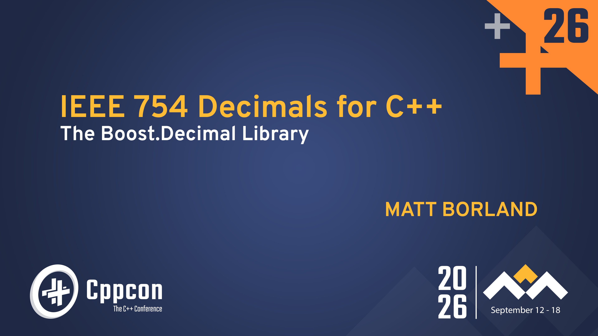

^ Welcome to IEEE 754 Decimals for C++ - The Boost Decimal library.

^ I am Matt Borland and today we will discuss a relatively new IEEE type and Boost library

---

[.build-lists: true]
[.list: bullet-character( ), bullet-indent(0)]

# Start with a Quiz

What is the output of this program?

```c++
#include <iomanip>
#include <iostream>

int main() {
  std::cout << std::setprecision(17) << 0.1 + 0.2;
}
```

- 0.30000000000000004 and why is this?

^ First we will start with a quiz. What is the output of the program on the screen?

^ If you said 3 followed by 15 zeros then 4 you'd be correct. If not, we will see why this is the case

---

# Where the extra came from

The bitwise representation of `float f = 0.1f;`

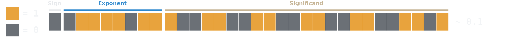

$$
0.1_{10} = 0.0\overline{0011}_2 \qquad \text{(never terminates)}
$$

$$
(-1)^{0} \times 1.10011001100110011001101_2 \times 2^{\,123-127} = \frac{13421773}{2^{27}} = 0.100000001490116119384765625
$$

^ Here are the bits of 0.1f which we will dive into greater detail later

^ We see that 0.1 in base 10 is 0.00011 in base two with the last four digits infinitely repeating

^ Since this never terminates it is actually slightly more than 0.1, but why does it not terminate?

---

# The Reason? Five does not divide two

A fraction terminates in base *b* only if every prime factor of its denominator divides *b*.[^1]

$$
\frac{1}{10} \qquad 10 = 2 \times 5 \qquad 5 \nmid 2
$$

No number of bits fixes this. The problem is not precision, but *representability*.

[^1]: Hardy & Wright, *An Introduction to the Theory of Numbers*, §9.2–9.3.

^ The explanation is actually quite easy, it is that five doe not divide two

^ As hardy and wright tell us "A fraction terminates in base *b* only if every prime factor of its denominator divides *b*"

^ This is not a precision problem, this is a representation problem

---

[.build-lists: true]

# The solution is not "more precision"

These numerical types we are about to discuss are useful when these errors are unacceptable.

- Canonical example and many users are in the financial sector
- Human-entered data and databases
- Legal and regulatory compliance

^ Since this is a representation problem the solution is not to simply add more precision such as using 128 bit floats

^ *Read the build slide*

---

[.build-lists: true]

# A brief history and availability

- **IEEE 754-2008** specifies decimal floating point with two encodings and three interchange formats
- **ISO/IEC TR 24733** (2011) sketches a C++ binding. Never adopted into the standard.
- **N3871** (2014) second attempt at adding decimal types to the C++ standard
- **C23** adds `_Decimal32` `_Decimal64` `_Decimal128` as an *optional* feature
- **GCC** libstdc++ ships these types on selected targets (`<decimal/decimal>`), without an accompanying standard library
- **IBM's libdfp** fills the library gap
- **Intel** ships a library with its own types

^ *Read the build slide*

^ There's an active P-paper for rebasing <cmath> on C23 <math.h>, but it specifically excludes Decimal types. 
For those interested it is (3935R2 for those interested) 

---

# Boost.Decimal

- Header-only, *no dependencies*, C++14
- Portable: tested on `x86_64`, `x86_32`, ARM64, ARM32, s390x; emulated PPC64LE and Cortex-M
- Complete Standard Library: `<cmath>`, `<charconv>`, `<format>`, etc.
- 3rd Party Library Integration: Boost.Math, {fmt}
- `constexpr` throughout
- CUDA support for the types and much of the math

^ *Read the build slide*

---

[.build-lists: true]

This talk will be divided into five parts

1. Inside the bits - how decimal floating point is represented
2. The types - an overview of the different types provided by the library, and how to use them
3. The Standard Library - similarities and differences with the STL
4. Performance - Comparisons between Boost.Decimal, libstdc++, and Intel decimal types
5. When to reach for it - Use cases from known users and takeaways 

^ *Read the build slide*

---

[.build-lists: false]

# Part 1 of 5

1. **Inside the bits**
2. The Types
3. The Standard Library
4. Performance
5. When to reach for it

^ Now lets take a look at the bits

---

# A Binary Floating Point Refresher

[.build-lists: true]
[.list: bullet-character( ), bullet-indent(0)]

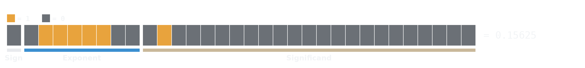

- $$ \text{float value} \;=\; (-1)^{\text{sign}} \times 2^{\,\text{exponent} - \text{bias}} \times \text{significand}_2 $$

- $$ (-1)^{0} \;\times\; 2^{\,124-127} \;\times\; 1.01_2 \;=\; 1.25 \times 2^{-3} \;=\; 1.25 \div 8 \;=\; 0.15625 $$

- Section 3.4 of IEEE 754-2019

^ Float value = ...

^ 1. sign bit 0, positive. 
2. Exponent field 01111100 is 124; subtract the
bias of 127 to get 2 to the minus 3. 
3. Fraction bits 01, with the implied leading 1, read 1.01 in binary give us 1.25. 
4. 1.25 over 8 is 0.15625.
5. 0.15625 is exactly representable in binary AND in decimal, which is why it was chosen

---

[.build-lists: true]
[.list: bullet-character( ), bullet-indent(0)]

# Same value with one additional field.

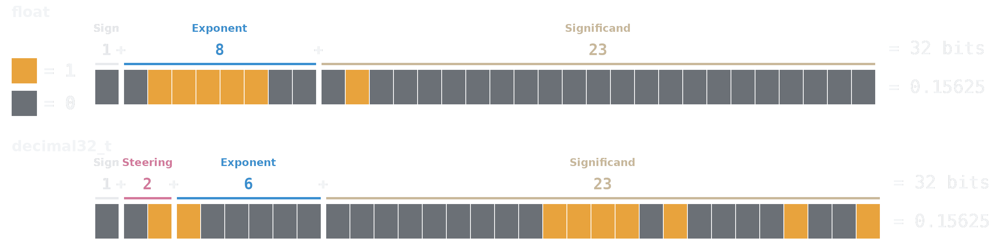

- $$ 11110100001001_2 = 15625 $$
- $$ 15625 \times 10^{-5} = 0.15625 $$
- The high two bits of the exponent become the *steering bits*

^ Here we can find 15625 in the significand since it's encoded like an integer would be

^ Then the exponent gives 10 ^-5 forming 0.15625

^ As you can see we've given up the high two bits of the exponent for what are referred to as steering bit. 
Together with the exponent this is called the *combination field*. What is this for though?

---

# Why add the combination field?

[.code-highlight: 1]
[.code-highlight: 1-3]
[.code-highlight: all]

```
decimal32_t holds 7 decimal digits -> max significand = 9,999,999

2^23 = 8,388,608 < 9,999,999
2^24 = 16,777,216 

You need 24 bits, but sign and exponent leave you with only 23.
```

^ JUST READ THE SLIDE*

---

# Four cases

[.build-lists: true]
[.list: bullet-character( ), bullet-indent(0)]
[.code-highlight: 1-2]
[.code-highlight: 1-3]
[.code-highlight: 1-4]
[.code-highlight: all]

```
steer                 layout                              sig. bits
 00    s | 00 | eeeeee   | ttttttttttttttttttttttt            23
 01    s | 01 | eeeeee   | ttttttttttttttttttttttt            23
 10    s | 10 | eeeeee   | ttttttttttttttttttttttt            23
 11    s | 11 | eeeeeeee | [100] + ttttttttttttttttttttt      24
```

- $$100_2$$ + 21 trailing 1s = 10,485,759 > 9,999,999

- Non-finite numbers also encode with 11 steering bits

- Example: infinity = 0 | 11 | 1100 + payload

^ Read the slide

^ The last two 0 bits for the infinity are used to make a quiet nan or a signaling nan

^ So what does this look like in practice?

---

# Watch the fields move for adjacent integers

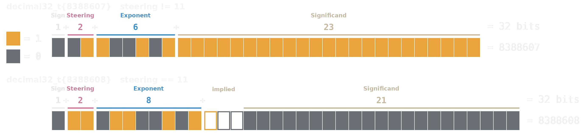

$$
8388607 = 11111111111111111111111_2 \qquad 23 \text{ stored bits}
$$

$$
8388608 = \underbrace{100}_{\text{implied}}\,000000000000000000000_2 \qquad 21 \text{ stored bits}
$$

^ As you can see incrementing by one can actually 

---

# `0.1`, both ways

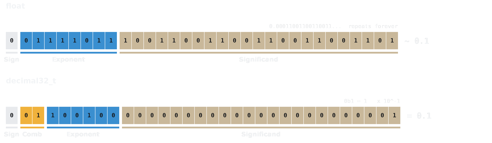

Instead of an infinite repeating sequence, we get an exact value


^ Returning to our earlier example of 0.1 we can now see how it is exactly represented in the decimal type.
We have a clear 1 in the significand, and then a biased exponent which gives us 10^-1 resulting in an exact 0.1

---

# BID and DPD

IEEE 754 specifies two encodings:

- **BID**: Binary Integer Significand. Intended for software implementations.
- **DPD**: Densely Packed Decimal. Intended for hardware implementations.

Boost.Decimal uses **BID**, and can convert either way:

```c++
constexpr std::uint32_t to_bid_d32(decimal32_t val)      noexcept;
constexpr decimal32_t   from_bid_d32(std::uint32_t bits) noexcept;
constexpr std::uint32_t to_dpd_d32(decimal32_t val)      noexcept;
constexpr decimal32_t   from_dpd_d32(std::uint32_t bits) noexcept;
```

^ For the sake of completeness there are actually two specified encodings for decimal floating point types

^ Read the slide

---

# BID vs DPD for our adjacent integers
[.code-highlight: 1]
[.code-highlight: 1-2]
[.code-highlight: 1,3]

```
                          BID           DPD
decimal32_t{8388607}  0x32FFFFFF    0x6A573B07
decimal32_t{8388608}  0x6CA00000    0x6A573B08
```

*BID* rebuilds the word. 
*DPD* increments by one.

^ Here is our edge case integer where the steering bits change

^ DPD packs three decimal digits into every ten-bit declet, so 607 and 608
^ live in the low bits and nothing else moves. BID treats the significand as
^ one binary integer, so changing the integer changes the encoding.

^ The benefit to this design is that digit locality is what you want when digits are in silicon

---

# [fit] Now the part with no

# [fit] binary analogue

^ Pacing beat. This concept is what makes the rest of the talk cohere, and
^ you call back to it four more times.

---

[.build-lists: true]
[.code-highlight: none]
[.code-highlight: 1]
[.code-highlight: 2]
[.code-highlight: 3]
[.code-highlight: 4]
[.code-highlight: all]

# One value. Seven Representations.

> "cohort: The set of all floating-point representations that represent a given floating-point number in a given floating-point format. 
In this context −0 and +0 are considered distinct and are in different cohorts."
-- IEEE 754-2019


```
decimal32_t{      3,  2}   ->   0x33800003
decimal32_t{     30,  1}   ->   0x3300001E
decimal32_t{    300,  0}   ->   0x3280012C
decimal32_t{3000000, -4}   ->   0x30ADC6C0
```

- All compare equal with `operator==`
- All *hash equal*
- None are bitwise equal

^ *READ AND BUILD THE SLIDE*

---

[.build-lists: true]

# Normalizing

- A value is *normalized* when the cohort effect is removed by appending zeros to the significand and reducing the exponent until it carries the type's full precision:

- Example: $$ 3 \times 10^{2} \quad \longrightarrow \quad 3000000 \times 10^{-4} $$

- Every arithmetic operation and every comparison has to handle the effects of cohorts.

- This is among the most expensive parts of these operations.

^ Read the slide

^ Remember from our last slide that -0 and +0 are considered to be in distinct and in different cohorts so this has to be handled as well

---

[.build-lists: false]

# Part 2 of 5

1. Inside the bits
2. **The Types**
3. The Standard Library
4. Performance
5. When to reach for it

---

# One Include

```c++
#include <boost/decimal.hpp>
```

Header-only. No dependencies. C++14.

```c++
import boost.decimal; // C++20 module
```

- Available individually through vcpkg and conan, or with Boost in most package managers
- Build with b2 or CMake

---

# Six types

Three IEEE 754 compliant types:
```
                     bytes   digits10       exponent range
decimal32_t              4          7        -95 ..    +96
decimal64_t              8         16       -383 ..   +384
decimal128_t            16         34      -6143 ..  +6144
```
Three performance-focused types:
```
decimal_fast32_t         8          7        -95 ..    +96
decimal_fast64_t        16         16       -383 ..   +384
decimal_fast128_t       32         34      -6143 ..  +6144
```

The performance costs exactly double the size.

---

# What the extra bytes buy

[.code-highlight: 1-4]
[.code-highlight: all]

```c++
class decimal32_t final {
    std::uint32_t bits_;            // IEEE 754 BID
};

class decimal_fast32_t final {
    std::uint32_t significand_;     // stored decoded and normalized
    std::uint8_t  exponent_;
    bool          sign_;
};
```

^ For decimal32_t every operation starts with decoding the value into
significand, exponent, and sign. With the fast types we skip this
entirely and store the value always normalized.

---

# Which one to use?

**Does the bit pattern matter?**

- *Yes*: a file, a socket, a column, another language, another vendor
  → `decimal32_t` `decimal64_t` `decimal128_t`
- *No*: computed, compared, and discarded
  → `decimal_fast32_t` `decimal_fast64_t` `decimal_fast128_t`

^ Yes is effectively when using it as an interchange format
^ No is using it for your own computations

---

# Construction

[.code-highlight: 1]
[.code-highlight: 2]
[.code-highlight: 3]
[.code-highlight: 4]
[.code-highlight: 5]

```c++
decimal32_t a {1, 1};                                  // 1e1
decimal32_t b {-2, -1};                                // -0.2
decimal32_t c {2U, -1, construction_sign::negative};   // -0.2
decimal32_t d {"4.3e-02"};                             // string or string_view
auto        e {"3.14159265358979"_DF};                 // literal, rounds to fit
```

^ Thirty seconds. The design point worth saying out loud: a signed
^ coefficient or an explicit sign, never both — because what would the
^ sign of {-3, 0, negative} be? The API refuses to be asked.
^
^ Literals live in namespace boost::decimal::literals, like std::literals.
^ _DF _DD _DL, and add an f for the fast types.

---

# It promotes like you expect

```c++
decimal32_t{}       + decimal64_t{}        ->  decimal64_t
decimal64_t{}       * 2                    ->  decimal64_t
decimal64_t{}       + decimal_fast32_t{}   ->  decimal64_t
decimal_fast128_t{} - decimal128_t{}       ->  decimal_fast128_t
```

Wider precision wins. On a tie, *fast wins*.

```c++
decimal32_t{}       + decimal_fast32_t{}   ->  decimal_fast32_t
```

^ Mixed comparison works across all six types and against integers, and it
is exact even when the value is not representable in the narrower type —
which is exactly the trap you fall into if you cast by hand first.

---

# What it will not do quietly

[.code-highlight: 1]
[.code-highlight: 2]
[.code-highlight: 3]

```c++
decimal64_t d {3.14};        // explicit only, and discouraged
int n = d;                   // ill-formed and compiler error
int n = static_cast<int>(d); // OK
```

^ Conversion from binary float is discouraged due to the representation problem discussed earlier

^ Conversions to and from integers is explicit because they are also not guaranteed to be lossless

---

[.build-lists: false]

# Part 3 of 5

1. Inside the bits
2. The Types
3. **The Standard Library**
4. Performance
5. When to reach for it

^ Now that we have covered the basics of they types we will cover the library functions that make the useful

---

[.build-lists: false]
[.code-highlight: 1]
[.code-highlight: 2]
[.code-highlight: 3]
[.code-highlight: 4]
[.code-highlight: 5]
[.code-highlight: 6]
[.code-highlight: 7]
[.code-highlight: 8]
[.code-highlight: 9]
[.code-highlight: 10]
[.code-highlight: 11]
[.code-highlight: all]

# What comes in the box

```text
<cmath>        over a hundred functions, all constexpr
<charconv>     to_chars / from_chars, plus two decimal-only formats
<format>       and {fmt}
<cstdlib>      strtod32 / strtod64 / strtod128
<cfenv>        rounding modes
<cfloat>       evaluation modes
<functional>   std::hash, all six types
<limits>       numeric_limits, all six types
<string>       to_string, stod32 ...
<iostream>     operator<< and operator>>
<numbers>      pi, e, ln2, ... per type
```

Everything lives in `boost::decimal`, except literals, which live in `boost::decimal::literals`.

---

# Generic code: the `std::swap` two-step

```c++
template <typename T>
void work_with_cmath(T val)
{
    using std::sin;
    using boost::decimal::sin;

    auto result = sin(val); // unqualified. float, double, decimal128_t, etc. work
	...
}
```

^ If you write generic numeric code you are probably familiar with this idiom already

---

# All of it is `constexpr`

```c++
constexpr decimal64_t two  {2};
constexpr decimal64_t root {sqrt(two)};

static_assert(root == "1.414213562373095"_DD, "");
```

`std::sqrt` is not `constexpr` until C++26.

^ To the greatest extent possible everything is constexpr.
All of the <cmath> functions are implemented in native arithmetic whereas the Intel library for example casts to builtin binary floating point, uses the MKL, and then constructs the result

---

[.build-lists: true]

# Two ways to decompose a value

Three spellings of `300`, taken apart two ways:

```
decimal32_t{300}          decompose  ->  sig 300,      exp  0
                          frexp10    ->  sig 3000000,  exp -4

decimal32_t{3, 2}         decompose  ->  sig 3,        exp  2
                          frexp10    ->  sig 3000000,  exp -4

decimal_fast32_t{3, 2}    decompose  ->  sig 3000000,  exp -4
                          frexp10    ->  sig 3000000,  exp -4
```

- `decompose` retains the cohort
- `frexp10` normalizes it away
- The fast types return the same for both since they store normalized

^ example/decompose_frexp10_normalize.cpp, verbatim.

^ These functions both live in the <cmath> header

---

# [fit] A deeper look into `<charconv>`

^ We will not look at our expanded version of <charconv> as being able to process base-10 values is one of the key selling points of the library 
This is the part that is most used by our known clients

---

[.code-highlight: 1-2, 3, 9]
[.code-highlight: 1-2, 4, 9]
[.code-highlight: 1-2, 5, 9]
[.code-highlight: 1-2, 6, 9]
[.code-highlight: 1-2, 7, 9]
[.code-highlight: 1-2, 8, 9]

# `chars_format` options

```c++
enum class chars_format : unsigned
{
    scientific,
    fixed,
    hex,
    general = fixed | scientific,
    cohort_preserving_scientific,     // not in <charconv>
    cohort_preserving_fixed,          // not in <charconv>
};
```

^ Scientific, fixed, hex and general are the same as you are used to

^ Cohort preserving scientific and fixed will reject values that require any rounding

---

# The round trip

[.code-highlight: 1-7]
[.code-highlight: all]

`<charconv>` using `chars_format::cohort_preserving_scientific`

```
"3e+02"         ->  0x33800003  ->  "3e+02"
"3.0e+02"       ->  0x3300001E  ->  "3.0e+02"
"3.00e+02"      ->  0x3280012C  ->  "3.00e+02"
"3.000e+02"     ->  0x32000BB8  ->  "3.000e+02"
"3.0000e+02"    ->  0x31807530  ->  "3.0000e+02"
"3.00000e+02"   ->  0x310493E0  ->  "3.00000e+02"
"3.000000e+02"  ->  0x30ADC6C0  ->  "3.000000e+02"
```

^ THE payoff slide for the whole cohort thread. Earn it with silence.
^
^ STEP 1 — the round trips. "Every one of those is `==` to every other one."
^
^ STEP 2 — the format name. "One enumerator. That is the entire feature."
^
^ "If you write 3.00 to a ledger, you get 3.00 back out of the ledger. Not
^ 3, and not 3.000000."

---

# Sizing buffers

```c++
template <typename DecimalType, int Precision = std::numeric_limits<DecimalType>::max_digits10>
class formatting_limits
{
public:
    static constexpr std::size_t scientific_format_max_chars;
    static constexpr std::size_t fixed_format_max_chars;
    static constexpr std::size_t hex_format_max_chars;
    static constexpr std::size_t cohort_preserving_scientific_max_chars;
    static constexpr std::size_t cohort_preserving_fixed_max_chars;
    static constexpr std::size_t general_format_max_chars;
    static constexpr std::size_t max_chars;
};
```

This simplifies correct buffer sizing to:

```c++
char buf[formatting_limits<decimal64_t>::scientific_format_max_chars];
```

^ Max chars is the absolute maximum of all listed formats

---

# [fit] Integration with other libraries

---

# Two ways to format

```
                    needs                              standard
<fmt/format.h>      {fmt} 11 or newer                  C++14
<format>            GCC 13 · Clang 18 · MSVC 19.40     C++20
```

```c++
fmt::format("{:*>+12.2e}", val);      // [***+3.14e+00]
std::format("{:*>+12.2e}", val);      // [***+3.14e+00]
```


^ Thirty seconds.
^
^ Be accurate about what this is: these are adapters, and we wrote them.
^ format.hpp and fmt_format.hpp are a thousand lines of formatter
^ specialization between them, plus another hundred and thirty for the
^ std::hash specializations. The user does not write an adapter. We did.
^
^ THIS is the one header the umbrella does not pull in: fmt_format.hpp,
^ because {fmt} is an external and possibly-compiled dependency. Include it
^ yourself. That is the exception you promised eight minutes ago.
^
^ The {fmt} floor is 11, because detection keys on <fmt/base.h>. Verified
^ against 9.1, 10.2 and 11.1 — the first two are not detected.

---

# One extra formatting specifier

```
g G    general
e E    scientific
f      fixed
x X    hex
a A    cohort preserving scientific
```

```c++
fmt::format("{}",   d);     // 300
fmt::format("{:a}", d);     // 3.00e+02
```

^ Alignment, fill, width, sign, precision and the L locale modifier all
^ behave exactly as they do for built-in floating point. 

# [fit] Rounding

^ Short divider, or run the next two straight — your call on the clock.

---

[.build-lists: true]

# Binary Floating Point Rounding

In `<cfenv>` we have the following four macros useable with `std::fesetround()`:

1. `FE_DOWNWARD` - Rounding towards negative infinity 
2. `FE_TONEAREST` - Rounding towards nearest representable value
3. `FE_TOWARDZERO`- Rounding towards zero
4. `FE_UPWARD` - Rounding towards positive infinity 

---

# The Five Decimal Rounding Modes

All modes are in `enum class rounding_mode` and useable with `boost::decimal::fesetround()`:

1. `fe_dec_downward`
2. `fe_dec_to_nearest` - To nearest, ties to even
3. `fe_dec_to_nearest_from_zero`
4. `fe_dec_toward_zero` - The opposite of 3
5. `fe_dec_upward`

Default is #2, per IEEE 754 4.3.3 and is called "banker's rounding", and is available also as *`fe_dec_default`*

---

# Example of Rounding Mode

```c++
#include <boost/decimal.hpp>
#include <iostream>

int main() {
    using namespace boost::decimal::literals;
    using boost::decimal::decimal32_t;

    boost::decimal::fesetround(boost::decimal::rounding_mode::fe_dec_upward); // NOT THREAD-SAFE

    const decimal32_t lhs {"5e+50"_DF};
    const decimal32_t rhs {"4e+40"_DF};
    const decimal32_t sum {lhs + rhs};

    std::cout << "5e50 + 4e40 = " << sum << std::end;
}
```
Output: `5e50 + 4e40 = 5.000001e+50`

^ Even though the difference in order of magnitude is greater than the precision of the type, any addition in this mode will result in at least a one ULP difference

---

# Compile Time Rounding

Very similar to the run-time `enum class`, but we now have the following macros:

1. `BOOST_DECIMAL_FE_DEC_DOWNWARD`
2. `BOOST_DECIMAL_FE_DEC_TO_NEAREST`
3. `BOOST_DECIMAL_FE_DEC_TO_NEAREST_FROM_ZERO`
4. `BOOST_DECIMAL_FE_DEC_TOWARD_ZERO`
5. `BOOST_DECIMAL_FE_DEC_UPWARD`

^ Each of these are the same as their runtime counterparts. Must be defined prior to any decimal header

---

# Changing the Compile Time Rounding Mode

```c++
#define BOOST_DECIMAL_FE_DEC_DOWNWARD   // before ANY decimal header

#include <boost/decimal/decimal32_t.hpp>
#include <boost/decimal/literals.hpp>

using namespace boost::decimal::literals;
using boost::decimal::decimal32_t;

constexpr decimal32_t lhs {"5e+50"_DF};
constexpr decimal32_t rhs {"4e+40"_DF};
constexpr decimal32_t res {lhs - rhs};

static_assert(res == "4.999999e+50"_DF, "Incorrectly rounded result");
```

^ Three points, one slide. Do all three.
^
^ 1. Magnitudes differ by ten orders of magnitude — further apart than the
^    precision of the type. In a directed mode you still move a full ULP.
^    Changing the rounding mode changes your answers.
^
^ 2. The macro works on every compiler, and being read-only it is thread
^    safe. There is a runtime fesetround too, which needs consteval
^    detection and is NOT thread safe. One sentence each.
^
^ 3. That is a static_assert on a rounded decimal subtraction. Seed for
^    Part 4 — we got constexpr, and we paid for it.

---

# Boost.Math Integration

Bollinger bands over a year of AAPL closes.

```c++
#include <boost/math/statistics/univariate_statistics.hpp>
#include <boost/decimal.hpp>

std::vector<decimal64_t> closes;

// Import closing data from a data source of AAPL 

const decimal64_t mean   = boost::math::statistics::mean(closes);
const decimal64_t median = boost::math::statistics::median(closes);
const decimal64_t var    = boost::math::statistics::variance(closes);
const decimal64_t sigma  = boost::decimal::sqrt(var);
```

```
  Mean Closing Price: $207.20
  Standard Deviation: $25.45
Upper Bollinger Band: $258.11
Lower Bollinger Band: $156.30
```

^ In prior releases you needed BOOST_DECIMAL_ALLOW_IMPLICIT_INTEGER_CONVERSIONS.

^ This is from the example/ directory in the repo

---

# On the GPU

```c++
#define BOOST_DECIMAL_ENABLE_CUDA
#include <boost/decimal/decimal64_t.hpp>

__global__ void add(const decimal64_t* a, const decimal64_t* b,
                    decimal64_t* out, int n)
{
    const int i {blockDim.x * blockIdx.x + threadIdx.x};
    if (i < n) { out[i] = a[i] + b[i]; }
}
```

Device results compare to the same loop run on the host

---

# Debugging Pretty Printers

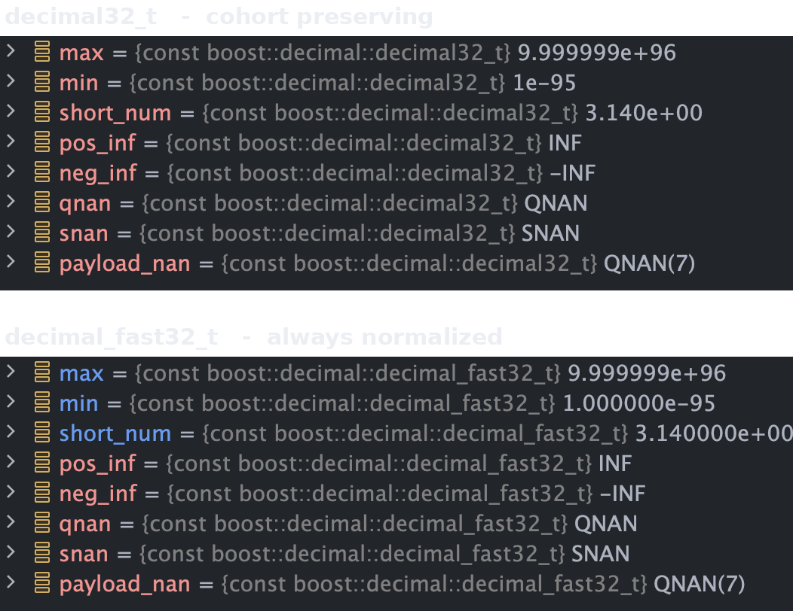

^ The debugger understands and represents cohorts

^ Support is available for GDB, LLDB and NATVIS

---

[.build-lists: false]

# Part 4 of 5

1. Inside the bits
2. The Types
3. The Standard Library
4. **Performance**
5. When to reach for it

---

# Benchmarks

Complete Benchmarks are available for the following systems:

1. x86_64 Linux
2. x86_32 Linux
3. x86_64 Windows
4. ARM64 Windows
5. ARM64 MacOS

GCC `_DecimalXX` and Intel `BID_UINTXX` are included where available for completeness

^ Linux uses both GCC and the new Clang-Based Intel Compiler

^ Windows uses MSVC

^ macOS uses homebrew Clang 22 on an M4 Max MacBook Pro

^ Methodology: 20-million-element random vectors, element-wise operations, five repetitions. Every number that follows is derived from the runtime columns of the published benchmark tables.

<!-- perf figures: img/perf_*.png generated by make_perf_charts.py from
     perf_data.py; data transcribed from
     https://www.boost.org/doc/libs/develop/libs/decimal/doc/html/benchmarks.html
     (develop docs, fetched 2026-08-27), cross-verified against the published
     ratio-to-double column (474 entries). Normalization: vendor charts vs
     same-width decimalN_t; ARM64 and charconv charts vs hardware double.
     Palette: stand-in hexes in perf_data.py pending the bit-strip values. -->

---

# 32-bit Types

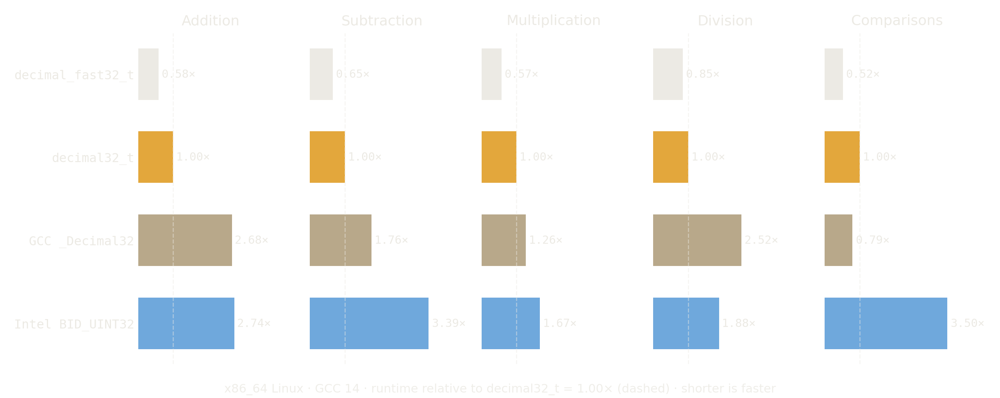


^ Everything is runtime relative to decimal32_t = 1.00 on x86_64 Linux with GCC 14.

^ Baseline context the chart hides: decimal32_t itself runs roughly 19–39× a hardware double on this platform depending on the operation. Software against hardware — decimal will be slower, and we say so up front.

^ Honesty notes for Q&A: the GCC and Intel numbers come from very close but not identical benchmark routines, written in C rather than C++ (per the docs). And under Intel's own compiler, their 32-bit library wins several operations against decimal32_t — multiplication even against decimal_fast32_t. The appendix has that chart.

---

# 64-bit Types

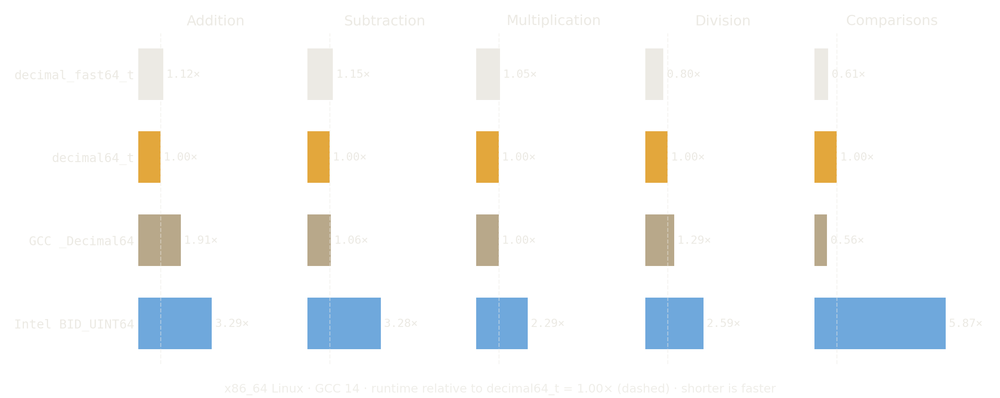

One honest loss: GCC `_Decimal64` compares faster than we do

^ _Decimal64 takes comparisons at 0.56× and effectively ties multiplication at 1.00×; the Boost types hold addition, subtraction, and division. Intel's BID_UINT64 comparisons are the outlier at 5.87× — it sets the shared scale.

---

# 128-bit Types

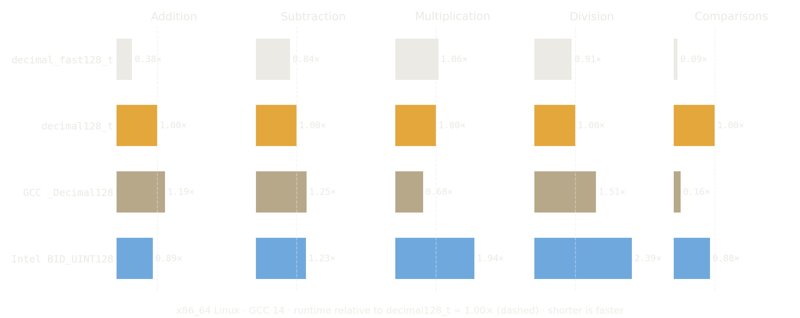

The closest race of the three widths

^ GCC _Decimal128 genuinely takes multiplication (0.68× of decimal128_t, with decimal_fast128_t at 1.06×). Intel BID_UINT128 beats decimal128_t on addition (0.89×) but not decimal_fast128_t (0.38×). Everything else goes to the Boost types — including the 0.09× comparison number for decimal_fast128_t, consistent with the fast layout skipping the decode step entirely.

---

# Where decimal beats the hardware

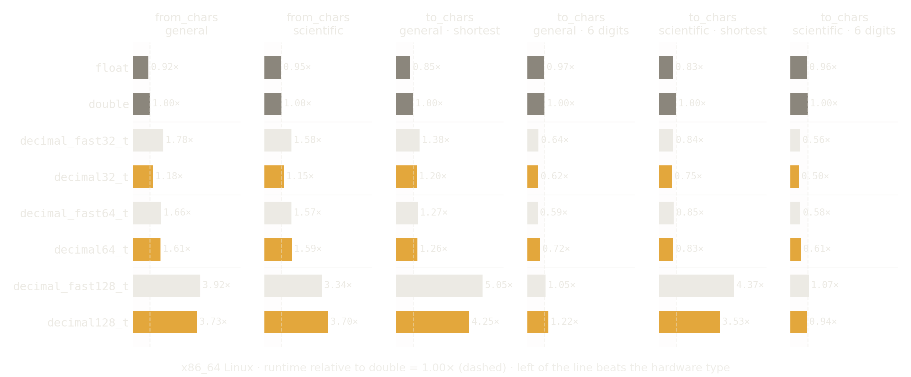

- `<charconv>` is software for every type so the hardware advantage disappears

^ This is also the one case where the fast types are not faster, they have to perform the normalization arithmetic that the regular types do not have to do.

^ Boost.Charconv is about 15,000 lines for the full implementation whereas this is under 2,000 in decimal

---

# Part 5 of 5

1. Inside the bits
2. The Types
3. The Standard Library
4. Performance
5. **When to reach for it**

---

# Use Cases Revisited

At the top of the presentation we suggested:

- Canonical example and many users are in the financial sector
- Human-entered data and databases
- Legal and regulatory compliance

---

# Current Clients Applications

- A trading firm, because their home-brew fixed point could not represent the smallest divisible unit of a Bitcoin (A Satoshi = 1/100,000,000 of a Bitcoin)
- Several quant firms, who use `<charconv>` extensively
- A database firm, who needed `decimal128_t` to be run on ARM
- Boost.MySQL for the DECIMAL data type (in conjunction with Boost.Multiprecision)
  
^ As Boost is typically consumed from package managers it is generally quite difficult to know who your customers are. 
These ones have specifically engaged throughout the development process both publicly or privately

---

# Takeaways

- Decimal Floating Point types can provide a new way to handle data and computations, but there is a performance cost
- Boost.Decimal is portable, performant, and available everywhere.

---

# Questions and Citation


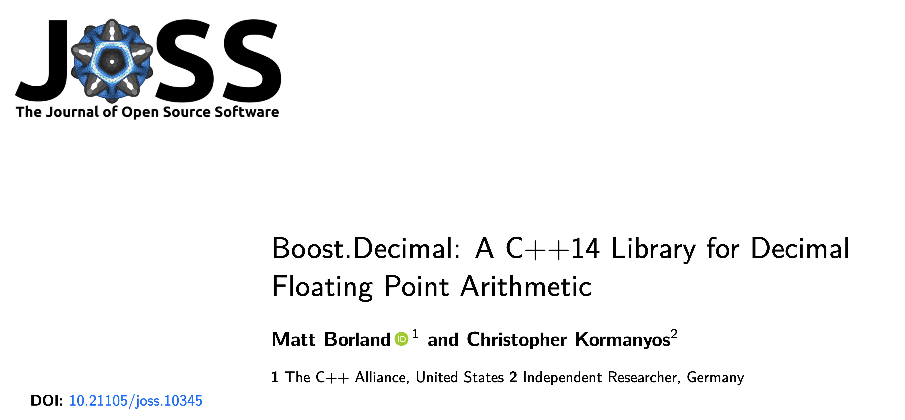

https://joss.theoj.org/papers/10.21105/joss.10345 or CITATION.cff in the repo


---

# Appendix

^ Backup material — full platform-by-platform benchmark coverage. Not part of the timed talk.

---

# x86_64 Linux · Intel oneAPI — 32 bits

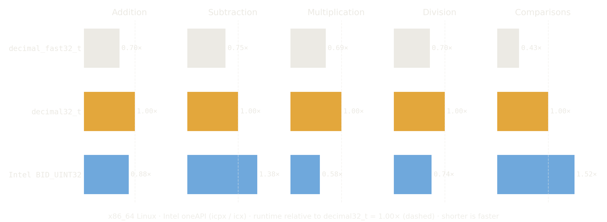

^ icpx compiles the Boost.Decimal harness, icx compiles Intel's libbid — same 20-million-element methodology. This is the config where Intel's 32-bit library wins addition, multiplication, and division against decimal32_t; decimal_fast32_t still leads everywhere except multiplication.

---

# x86_64 Linux · Intel oneAPI — 64 bits

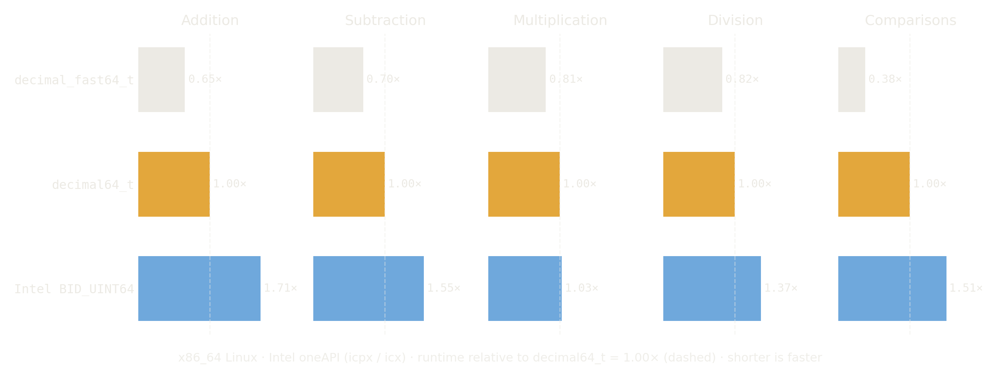

---

# x86_64 Linux · Intel oneAPI — 128 bits

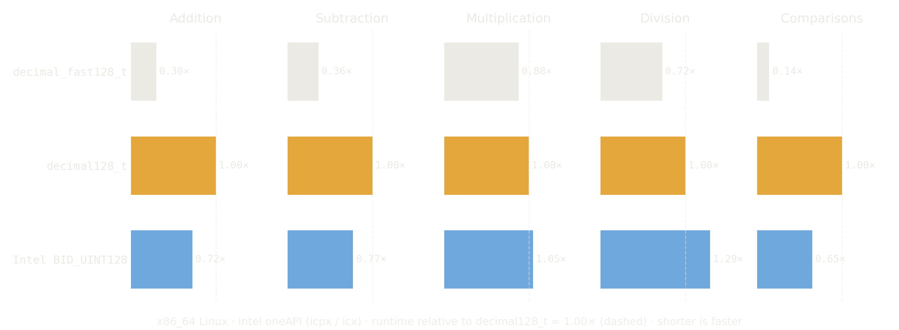

---

# x86_32 Linux · GCC 14 (-m32) — 32 bits

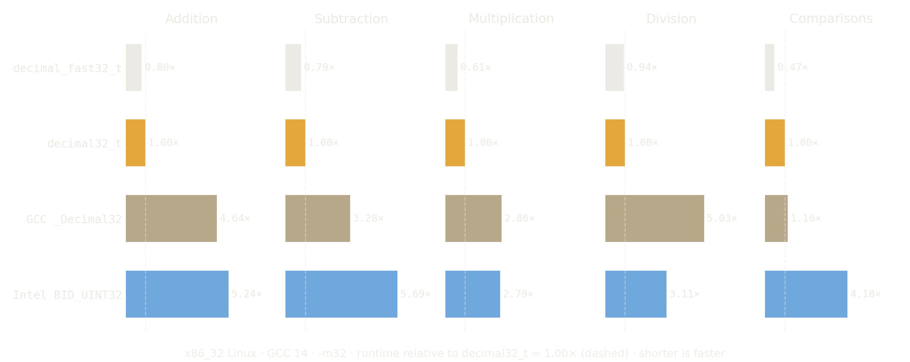

^ Same runner as x86_64 Linux, built -m32. 64- and 128-bit multiplication and division get markedly more expensive without native 64-bit registers.

---

# x86_32 Linux · GCC 14 (-m32) — 64 bits

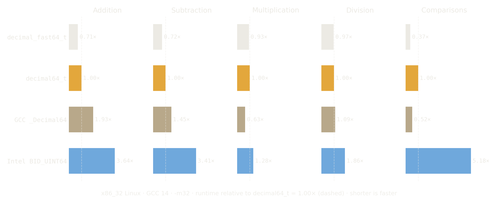

---

# x86_32 Linux · GCC 14 (-m32) — 128 bits

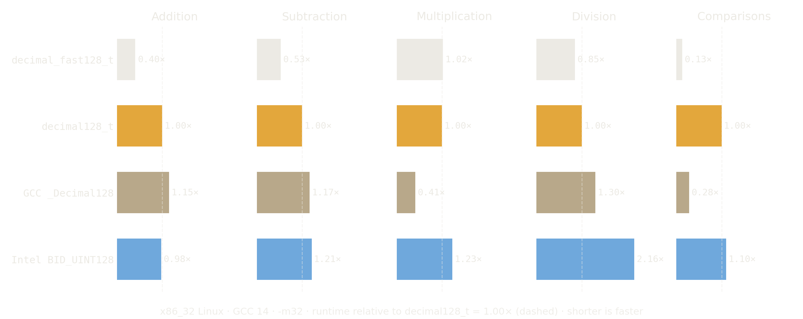

---

# x86_64 Windows · MSVC — 32 bits

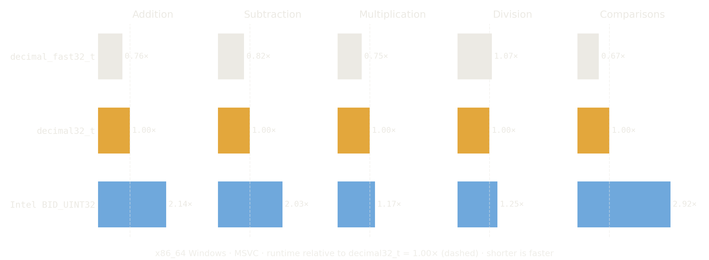

---

# x86_64 Windows · MSVC — 64 bits

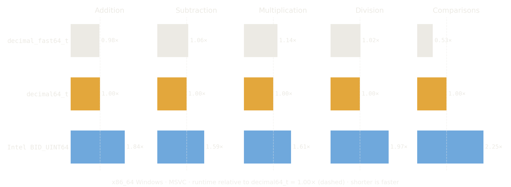

---

# x86_64 Windows · MSVC — 128 bits

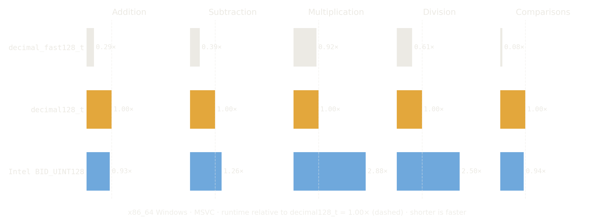

^ BID_UINT128 multiplication lands at 2.88× of decimal128_t here — 607× of hardware double.

---

# ARM64 Windows · MSVC

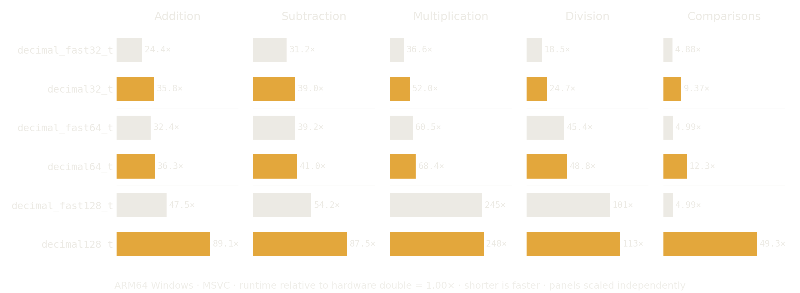

^ No vendor decimal types exist for this target — MSVC ships no built-in decimal type, and Intel's library supports only IA-32, IA-64, and Intel x64 — so bars are relative to hardware double, and panels scale independently.

---

# ARM64 macOS · M4 Max

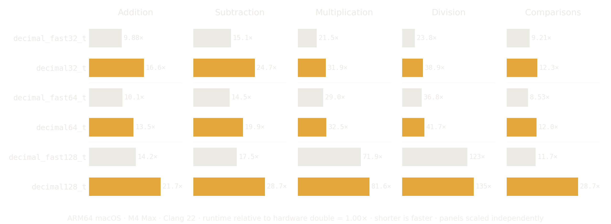

^ Homebrew Clang 22.1.7 on macOS Tahoe 26.5.1; Clang provides no built-in decimal types. Same normalization as the previous slide.

---

# `<charconv>` — x86_64 Windows · MSVC

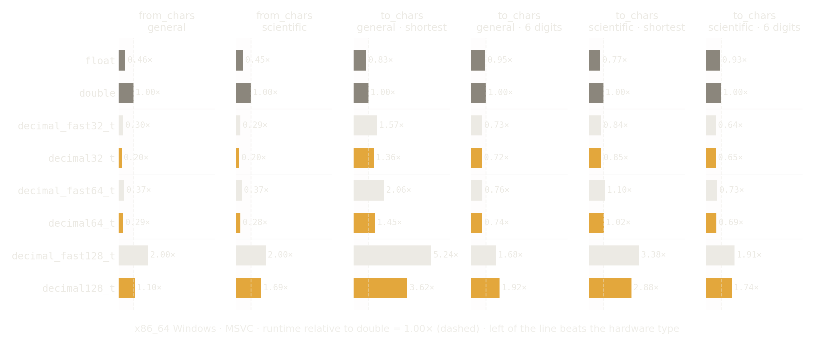

^ The headline number: from_chars for decimal32_t at ~0.21× of MSVC's double from_chars. Both from_chars variants beat the hardware types for every decimal type except the 128-bit ones.

---

# `<charconv>` — ARM64 macOS

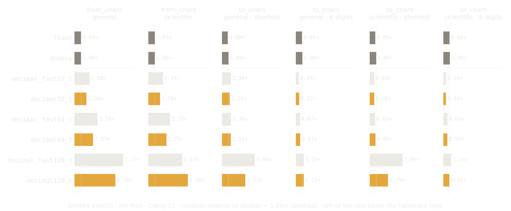

^ from_chars trails double across the board here; to_chars wins at fixed precision and for 32/64-bit scientific shortest.
